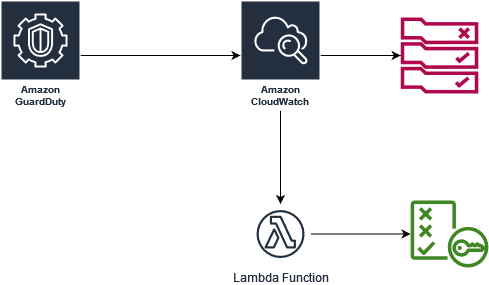
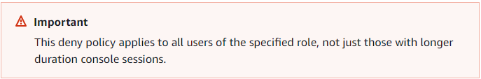

# IAM Role Credentials Exfill



> This is a automated workflow that uses a Lambda function and retrieves the Role name from the GuardDuty finding `UnauthorizedAccess:IAMUser
/InstanceCredentialExfiltration.OutsideAWS` details and then attaches an IAM policy that revokes all active sessions for the role. See workflow
illustration below.

### UnauthorizedAccess:IAMUser/InstanceCredentialExfiltration.OutsideAWS
#### Severity: High `7.0 - 8.9`
> Notes credentials that were created exclusively for an EC2 instance through an Instance launch role that is being used from an external IP address.


#### CloudWatch EventsRule:
> Event patterns have the same structure as the events they match. Rules use event patterns to select events and send them to targets. An event pattern
either matches an event or it doesn't. Here you can see we are only matching events with the type `UnauthorizedAccess:IAMUser
/InstanceCredentialExfiltration.OutsideAWS` from `aws.guardduty`.

```JSON
{
    "source": ["aws.guardduty"],
    "detail": {
    "type": ["UnauthorizedAccess:IAMUser/InstanceCredentialExfiltration.OutsideAWS"]
    }
}
```

#### IAM_RevokeSessionPolicy:
> The below policy is applied to revoke permissions for any credentials issued before the event time.
```json
{
    "Version": "2012-10-17",
    "Statement": [
        {
          "Sid": "RevokeCredentials",
          "Effect": "Deny",
          "Action": "*",
          "Resource": "*",
          "Condition": {
              "DateLessThan": {
                  "aws:TokenIssueTime": formatted_event_time }
          }
        }
  ]
}
```


#### Lambda Function:
> Please note that you need to adjust the IAM permissions of the Lambda function's execution role to allow the necessary IAM actions ( `iam:CreatePolicy`
and `iam:AttachRolePolicy`).

```python
import boto3
import json
from datetime import datetime

def lambda_handler(event, context):
    # Retrieve the roleName from the GuardDuty Finding.
    role_name = event['detail']['resource']['accessKeyDetails']['userName']

    # Extract the GuardDuty event time and format it.
    event_time = event['detail']['updatedAt']
    formatted_event_time = datetime.strptime(event_time, "%Y-%m-%dT%H:%M:%S.%fZ").strftime("%Y-%m-%dT%H:%M:%S")

    # Attach the IAM Policy to revoke all active sessions for the role
    iam_client = boto3.client('iam')
    policy_name = 'RevokeCredentialsPolicy'
    policy_document = {
        "Version": "2012-10-17",
        "Statement": [
            {
                "Sid": "RevokeCredentials",
                "Effect": "Deny",
                "Action": "*",
                "Resource": "*",
                "Condition": {
                    "DateLessThan": {
                        "aws:TokenIssueTime": formatted_event_time
                    }
                }
            }
        ]
    }
    response = iam_client.create_policy(
        PolicyName=policy_name,
        PolicyDocument=json.dumps(policy_document)
    )

    if response['ResponseMetadata']['HTTPStatusCode'] == 200:
        # Get the policy ARN
        policy_arn = response['Policy']['Arn']

        # Attach the policy to the role
        attach_response = iam_client.attach_role_policy(
            RoleName=role_name,
            PolicyArn=policy_arn
        )
        if attach_response['ResponseMetadata']['HTTPStatusCode'] == 200:
            return {
                'statusCode': 200,
                'body': f"Successfully attached policy to revoke permissions for temporary credentials for role: {role_name}"
            }
        return {
            'statusCode': response['ResponseMetadata']['HTTPStatusCode'],
            'body': f"Error attaching policy to revoke permissions for temporary credentials for role: {role_name}"
        }
```
### Disclosure
> Valid users whose sessions are revoked in this way must `acquire temporary credentials` for a `new session` to continue working. Note that the AWS CLI
caches credentials until they expire. To force the CLI to delete and refresh cached credentials that are no longer valid, run one of the following commands:


#### Linux, MacOS, or Unix:
``` shell
$ rm -r ~/.aws/cli/cache
```

#### Windows:
```commandline
C:\> del /s /q %UserProfile%\.aws\cli\cache
```

